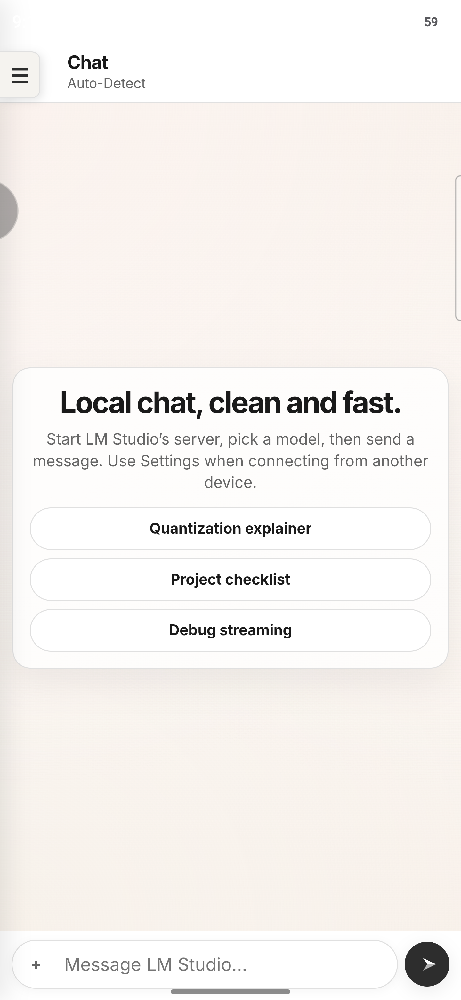

# Signal LM

> A lightweight, local-first AI chat studio — runs in the browser or as a desktop app, connects to any LM Studio-compatible server, and extends onto Android with Vulkan GPU inference.



---

## What is Signal LM?

Signal LM is an open-source front-end for local language models. It talks to an **LM Studio** server (or any OpenAI-compatible `/v1` endpoint) and adds a layer of practical features on top of the raw API:

| Feature | Description |
|---|---|
| **Chat** | Full conversation UI with streaming, code-block rendering, syntax highlighting, export, and persistent history |
| **Folders / Workspace** | Load a project folder into context — browse files, select what the model sees, and apply AI-generated edits with a review step before anything is written |
| **Silent Context Helper** | Pre-processes workspace files before each request, sending only the most relevant snippets instead of dumping the whole folder — reduces prompt size and speeds up inference |
| **MCP (Model Context Protocol)** | Add remote or local MCP tool integrations so the model can call external services during chat |
| **Android + Vulkan Runtime** | Run inference on-device on an Android phone via a native bridge; or use **Hybrid mode** to keep the PC server primary and fall back to / race against the phone |
| **Telemetry panel** | Right-side system sidebar shows live CPU, RAM, GPU, storage, and LM Studio model count from the local `tel-server.js` helper |
| **Themes** | System / Light / Dark, persisted in `localStorage` |

---

## Getting Started

### Prerequisites

- [Node.js](https://nodejs.org/) (v18 or later)
- [LM Studio](https://lmstudio.ai/) running locally with the server enabled  
  *(default: `http://localhost:1234/v1`)*

### 1 — Install dependencies

```powershell
npm install
```

### 2 — Run as a desktop app (recommended)

```powershell
npm run desktop
```

This opens Signal LM in an Electron window **and** starts `tel-server.js` automatically so the System Status panel can read CPU, RAM, GPU, and storage metrics without a separate terminal.

### 3 — Run in the browser (static / web)

Open `index.html` directly, or serve the folder with any static file server.  
For the System Status panel to show hardware data, also start the telemetry helper:

```powershell
node tel-server.js
# or double-click tel-server.bat
```

The helper listens on `http://127.0.0.1:8766/status` (local-only). The app works without it — the status cards just show an offline state.

---

## Connecting to LM Studio

1. Open **Settings → Connection**
2. Set **Base URL** to your LM Studio server  
   - Same machine: `http://localhost:1234/v1`  
   - Phone or another device on the network: `http://<server-ip>:1234/v1`
3. Set **API Key** only if you enabled authentication in LM Studio (leave blank otherwise)
4. Click **Save Connection → Test PC Connection + Load Models**

---

## Runtime Modes

Signal LM supports three inference backends, selectable from the **Chat sidebar** or **Settings → Android Runtime**:

| Mode | Description |
|---|---|
| **LM Studio server** (default) | All requests go to the configured `/v1` endpoint |
| **Android Vulkan local only** | All inference runs on the phone via the native bridge; no PC server needed |
| **Hybrid boost** | PC server is primary; the phone provides backup compute via one of the strategies below |

### Hybrid Strategies

| Strategy | Behaviour |
|---|---|
| **Off** | PC server only (hybrid mode inactive) |
| **Fallback** | Try the PC first; if it fails or exceeds the timeout, run the same request on the phone |
| **Race** | Send the request to both at the same time; use whichever answers first and cancel the slower one |
| **Task Splitting** | PC generates the raw answer; phone generates a summary |

> **Note:** Hybrid mode does not merge PC VRAM and phone GPU memory into a single model. The phone runs a separate GGUF independently.

---

## Folders & AI Edits Workflow

1. Go to the **Folders** page (`#editor`)
2. Click **Select Folder** to load a project directory
3. Check the files you want to give the model as context
4. Click **Send Folder to Chat** to inject them into the chat context
5. In chat, describe the edit you want — e.g. *"Refactor the dark-mode CSS to use CSS variables"*
6. The model returns full replacement file contents
7. Return to **Folders → AI Folder Edits**, review the diff, and click **Apply Reviewed Edits**  
   — nothing is written to disk until you explicitly apply

The **Silent Context Helper** (`Settings → Silent Helper`) runs automatically before each request. It scores workspace files by relevance to your message and sends only compact, targeted snippets, keeping prompt size down and inference fast. Switch to *Full selected files* mode if you need the model to see an exact small file in its entirety.

---

## MCP Integrations

1. Go to **MCP** (`#mcp`)
2. Enable **MCP in chat**
3. Add a **Remote / Ephemeral MCP** integration with a server URL (e.g. `https://huggingface.co/mcp`), or an **LM Studio mcp.json Plugin** using its plugin ID
4. Save and run **MCP Smoke Test** to verify
5. Chat now routes through LM Studio's native REST endpoint with tool definitions injected

---

## System Status Panel

The right-side **System Status** sidebar shows:

- CPU model, logical cores, and usage %
- System RAM used / free / total
- GPU usage and VRAM (via `nvidia-smi` or Windows GPU engine counters)
- Storage used / free / total for the project drive
- LM Studio reachability and loaded model count

The desktop app starts `tel-server.js` automatically. For the browser version, run it manually or via `tel-server.bat`. The helper binds only to `127.0.0.1` and never sends data off your machine.

**Environment overrides for `tel-server.js`:**

| Variable | Default | Description |
|---|---|---|
| `SIGNAL_LM_TELEMETRY_PORT` | `8766` | Port the helper listens on |
| `SIGNAL_LM_API_BASE_URL` | `http://localhost:1234/v1` | LM Studio endpoint to probe |
| `SIGNAL_LM_API_KEY` | *(empty)* | API key if LM Studio auth is enabled |

---

## Building a Windows Installer

```powershell
npm run dist
```

The installer is written to `dist_new\Signal-LM-Setup-v1.0.5.9.exe`.

---

## Publishing Desktop Releases

Desktop installers are published as **GitHub Release assets** — do not commit them to the repo.

```powershell
npm version patch        # bumps version in package.json
git push origin main --tags
```

Pushing a `v*` tag triggers `.github/workflows/desktop-release.yml`, which builds the Windows installer on GitHub Actions and uploads it to the release.

**Latest stable installer URL** (used by the app header and Settings page):

```
https://github.com/falabellamichael/Signal-LM/releases/latest/download/Signal-LM-Setup.exe
```

To update an installed desktop app, download the latest installer and run it — it replaces the existing installation in-place.

---

## Android Native Bridge (Developer Reference)

To connect an Android WebView app as an inference runtime, expose one of these JavaScript objects before `index.html` loads:

```js
window.lmStudioLiteNative
window.NativeInferenceBridge
window.AndroidInferenceBridge
```

### Required methods

```ts
getHardwareStatus(): string        // JSON: GPU name, RAM, thermal state
listModels(): string               // JSON: array of available model paths
chatCompletion(payloadJson: string): string
generate(payloadJson: string): string   // optional fallback
cancelGeneration(): void               // recommended for race mode
```

### File/workspace methods (optional but needed for Folders)

```ts
selectFolder(): string
readFile(path: string): string
writeFile(path: string, content: string): void
writeFiles(payloadJson: string): void
```

See [`ANDROID_VULKAN_RUNTIME.md`](ANDROID_VULKAN_RUNTIME.md) for the full payload schema and runtime tuning starting points.

---

## Project Structure

| File / Folder | Purpose |
|---|---|
| `index.html` | Single-page app shell (Chat, Folders, MCP, Settings views) |
| `index.js` | Core chat logic, model loading, workspace, attachments |
| `index.css` | Main stylesheet |
| `signal-lm-commands.js` | Slash-command system for chat |
| `signal-lm-mcp-*.js` | MCP pipeline, auth, chat bridge, file-path resolution |
| `editor.js / editor.css` | Folders page logic and styles |
| `mcp.js / mcp.css` | MCP configuration page |
| `settings.js / settings.css` | Settings page |
| `system-sidebar.js / .css` | System Status panel |
| `shared.js / shared.css` | Utilities and tokens shared across pages |
| `tel-server.js` | Local telemetry server (CPU, RAM, GPU, storage) |
| `desktop-main.js` | Electron main process |
| `SignalLM-Android/` | Android companion app source |
| `ANDROID_VULKAN_RUNTIME.md` | Android bridge API reference |
| `SILENT_CONTEXT_HELPER.md` | Context helper internals |
| `TELEMETRY_HELPER.md` | Telemetry server reference |

---

## License

[GPL-3.0](LICENSE)
